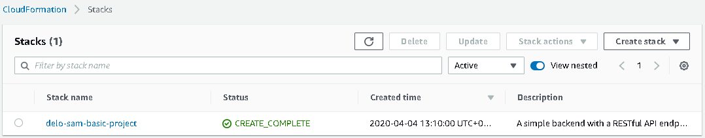
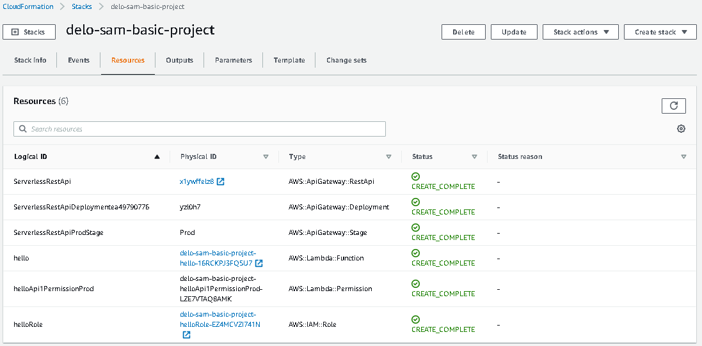

# A simple backend with a RESTful API endpoint using Amazon API Gateway

## Getting started
> #### You must have aws cli installed and configured

* Copy the files:
  * template.yml
  * handler.js
* Create s3 bucket `aws s3 mb s3://<your-bucket-name>`
* Packaged _template.yml_ file `aws cloudformation package --template-file template.yml --s3-bucket <your-bucket-name> --output-template-file packaged-template.yaml`  __it will create _packaged-template.yaml_ file__
* Deploy to AWS cloudformation `aws cloudformation deploy --template-file packaged-template.yaml --stack-name <your-cfm-name> --capabilities CAPABILITY_IAM`

It should output something like this.
```
Waiting for changeset to be created..
Waiting for stack create/update to complete
Successfully created/updated stack - delo-sam-basic-project
```
## You must now have this aws CloudFormation:

#### aws CloudFormation _(CloudFormation/Stacks)_



## Generated aws services

* aws ApiGateway
* aws Lambda
* aws IAM

#### aws CloudFormation _(CloudFormation/Stacks/delo-sam-basic-project)_



